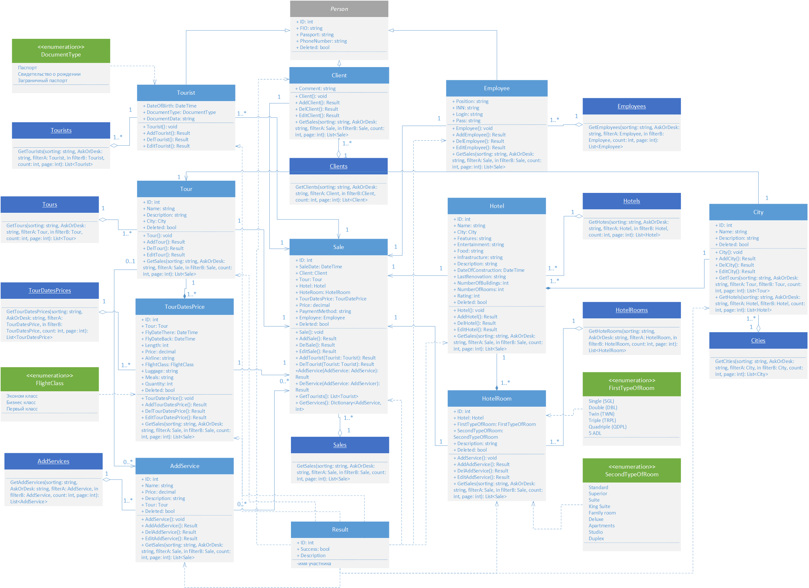
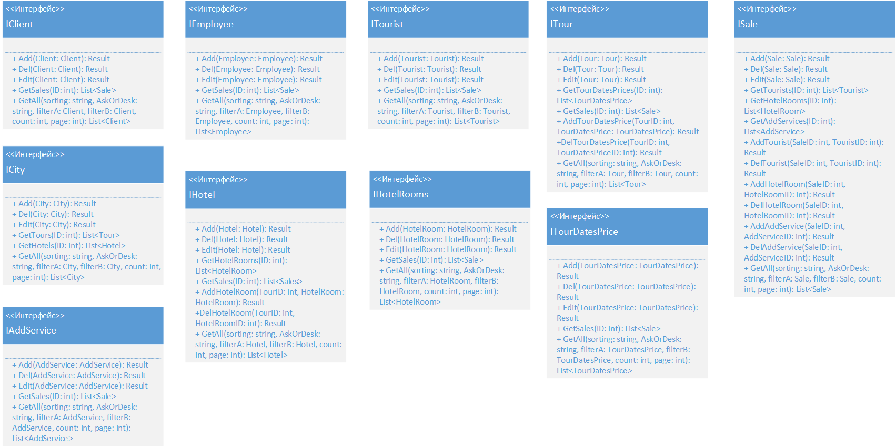

# Туристическая компания Avail
## Назначение программы:
Целью создания информационной системы является автоматизация процессов, происходящих в туристической компании.
В ходе эксплуатации планируется решить следующие задачи:
-	упрощение процесса продажи путевок;
-	формирование информационной базы;
-	контроль над финансовой деятельностью компании;
-	проведение анализа деятельности туристической компании;
-	оптимизировать функционирование туристической компании в целом;

## Диаграмма классов

### Список классов

- [Sale](docs/Classes/Sale.md "Класс Sale")
- [Person](docs/Classes/Person.md "Класс Person")
- [Client](docs/Classes/Client.md "Класс Client")
- [Employee](docs/Classes/Employee.md "Класс Employee")
- [Tourist](docs/Classes/Tourist.md "Класс Tourist")
- [Tour](docs/Classes/Tour.md "Класс Tour")
- [TourDatesPrice](docs/Classes/TourDatesPrice.md "Класс TourDatesPrice")
- [Hotel](docs/Classes/Hotel.md "Класс Hotel")
- [HotelRoom](docs/Classes/HotelRoom.md "Класс HotelRoom")
- [City](docs/Classes/City.md "Класс City")
- [AddService](./docs/Classes/AddService.md "Класс AddService")
- [Result](docs/Classes/Result.md "Класс Result")
- [DocumentType](docs/Classes/DocumentType.md "Enum интерфейс DocumentType")
- [FlightClass](docs/Classes/FlightClass.md "Enum интерфейс FlightClass")
- [FirstTypeOfRoom](docs/Classes/FirstTypeOfRoom.md "Enum интерфейс FirstTypeOfRoom")
- [SecondTypeOfRoom](docs/Classes/SecondTypeOfRoom.md "Enum интерфейс SecondTypeOfRoom")

## Диаграмма интерфейсов

### Список интерфейсов

- [ISale](docs/Interfaces/ISale.md "Интерфейс ISale")
- [IClient](docs/Interfaces/IClient.md "Интерфейс IClient")
- [IEmployee](docs/Interfaces/IEmployee.md "Интерфейс IEmployee")
- [ITourist](docs/Interfaces/ITourist.md "Интерфейс ITourist")
- [ITour](docs/Interfaces/ITour.md "Интерфейс ITour")
- [ITourDatesPrice](docs/Interfaces/ITourDatesPrice.md "Интерфейс ITourDatesPrice")
- [IHotel](docs/Interfaces/IHotel.md "Интерфейс IHotel")
- [IHotelRoom](docs/Interfaces/IHotelRoom.md "Интерфейс IHotelRoom")
- [ICity](docs/Interfaces/ICity.md "Интерфейс ICity")
- [IAddService](./docs/Interfaces/IAddService.md "Интерфейс IAddService")